# Watson OpenScale tutorial: credit-risk

Author: Jukka Ruponen / IBM, 2019-05-04  

This is a sample tutorial that will help you work with the AI OpenScale, now renamed as "Watson OpenScale".  

It is based on the Watson OpenScale tutorial [here](https://cloud.ibm.com/docs/services/ai-openscale?topic=ai-openscale-gs-obj#gs-obj), but is slightly modified to suit for some deep dive hands-on tutorials and workshops.  

Here is an overview of the scenario on this tutorial:  

For additional OpenScale exercises, take loot at:  
- https://github.com/pmservice/ai-openscale-tutorials  
- https://cloud.ibm.com/docs/services/ai-openscale?topic=ai-openscale-crt-ov#crt-ov  

## Pre-requisities

Before you continue, **you should have completed the Watson OpenScale fast-start tutorial** [here](https://cloud.ibm.com/docs/services/ai-openscale?topic=ai-openscale-wos-fast-start).  
If you have not, then complete the [fast-start tutorial](https://cloud.ibm.com/docs/services/ai-openscale?topic=ai-openscale-wos-fast-start) now, and then come back to this exercise.  

In short, to start the **fast-start tutorial** you'll:  
- Sign up and login to the IBM Cloud at https://cloud.ibm.com  
- Create a [Watson OpenScale](https://cloud.ibm.com/catalog/services/watson-openscale) service from the Catalog  
    
  You may change the **name** of the service to just "Watson OpenScale" and then press **[Create]**  
- On the Watson OpenScale service information page that opens automatically, press **[Launch Application]** button  
    
- When Watson OpenScale opens, press **[Run Demo]** and follow instructions  
    

**After completed the fast-start tutorial (above), you should have**:  
- IBM Cloud account (with an "IBM ID")
- Watson OpenScale service instance provisioned  

**In this exercise, you are also going to create additional services**:  
- **Watson Studio** instance (will be created in this exercise)
- **Watson Machine Learning** instance (will be created in this exercise)
- **Cloud Object Storage** instance (will be created in this exercise)

All these will be created from the [IBM Cloud Catalog](https://cloud.ibm.com/catalog), under the [AI](https://cloud.ibm.com/catalog?category=ai) category. Just follow the instructions on below.  

**Note**: If you already do have some of these additional services provisioned in IBM Cloud, then you may re-use them and, in that case, you do NOT need to re-create these services again. If that is the case, then just skip those steps within the instructions below and apply the information from your specific environment/services that already exist.  

## List of tasks/steps in this exercise
1. [Create the needed services](#step1)  
2. [Create and configure a project in Watson Studio](#step2)  
3. [Create and deploy "Credit Risk" model in WML (Watson Machine Learning service)](#step3)  
4. [Setup Watson OpenScale to connect to your deployed model in WML](#step4)  
5. [Configure OpenScale Monitors for "Credit Risk" model](#step5)  
  5.1 [Make a scoring request to WML for OpenScale to get the schema of the data](#step5.1)  
  5.2 [Prepare for monitoring](#step5.2)  
  5.3 [Configure fairness](#step5.3)  
  5.4 [Configure accuracy](#step5.4)  
6. [Provide feedback data (pre-labeled data for monitoring accuracy)](#step6)  
7. [Validate accuracy and fairness of the "Credit Risk" model in OpenScale](#step7)  
  7.1 [Quality of the model](#step7.1)  
  7.2 [Fairness of the model](#step7.2)  
8. [Make more scoring requests to WML to see how the monitored values change](#step8)  
9. [Provide additional feedback data to re-assess quality](#step9)  

## <a name="step1">Step 1 - Create the needed services</a>

Login to IBM Cloud at https://cloud.ibm.com  

#### Creating Cloud Object Storage instance

From the **IBM Cloud Dashboard**, click **Catalog**, search for text "**object storage**" and select "**Object Storage**",  
or click the image above, or click [here](https://cloud.ibm.com/catalog/services/cloud-object-storage)

Change service name to more descriptive, like:  
Service name:	**WS-ObjectStorage**  

Scroll down for "**Pricing Plans**"  
Make sure "**Lite**" is selected for free testing  

Press **[Create]**  

In the Cloud Object Storage service details page that opens do nothing. 

#### Creating Watson Machine Learning instance

Click **Catalog** again on the top menu, select **AI** category and select "**Machine Learning**" service,  
or click the image above, or click [here](https://cloud.ibm.com/catalog/services/machine-learning)

Change service name to more descriptive, like:  
Service name:	**Watson ML**  

Scroll down for "**Pricing Plans**"  
Make sure "**Lite**" is selected for free testing  

Press **[Create]**  

In Watson Machine Learning service details page that opens do nothing.  

#### Creating Watson Studio instance

Click **Catalog** again on the top menu, select **AI** category and select "**Watson Studio**" service,  
or click the image above, or click [here](https://cloud.ibm.com/catalog/services/watson-studio)

Change service name to more descriptive, like:  
Service name:	**Watson Studio**  

Scroll down for "**Pricing Plans**"  
Make sure "Lite" is selected for free testing  

Press **[Create]**  

You should be now at the Watson Studio service details page.  
  

Keep this page open for the next step.  

## <a name="step2">Step 2 - Create and configure a project in Watson Studio</a>

On the Watson Studio service details page, press **[Get Started]**  

You should be now at the **Watson Studio welcome page**.  
  

Let's continue by creating our AI project, configure the project with Cloud Object Storage and Watson Machine Learning services (that you created above) and finally create our model and deploy to WML.  

On the Welcome Page, press **[Create a project]**  

Click **"Standard"** to create an empty project.  
  

Set the follwing values for the project:  
  

  **Name**: AI model and validation project  
  **Description**: Credit Risk model for OpenScale monitoring and validation  
  **Define storage**: Select your just created "**WS-ObjectStorage**"  

Press **[Create]**  

You are now in an empty project.  

Let's connect the **Watson Machine Learning service** to our project.  

On the top row, select "**Settings**" tab and scroll down to "**Associated services**"  
Next to "**Associated services**" section, press **[Add service]** drop down list on the right and select "**Watson**".  
  

Then press **[Add]** on the "**Machine Learning**" service area.  
On the "**Existing**" tab, select your existing Machine Learning service "**Watson ML**", that you just created earlier.  
  

Press **[Select]**  

## <a name="step3">Step 3 - Create and deploy "Credit Risk" model in WML (Watson Machine Learning service)</a>

Let's create our Credit Risk model from sample.  

From the top actions, press **[+ Add to project]** and select "**Watson Machine Learning model**"  
  

On the right side section, select model type as "**From sample**"  
Select "**Credit Risk**" model (notice that when selected the name of model was also set to "**credit-risk**")  
  

Press **[Create]**  

Since your newly created model now opens in WML, we can also deploy it at once.  
  

Select "**Deployments tab**" and click **[Add deployment]**.  
  

Define the settings as:  
  **Name**: credit-risk-deployment   
  **Deployment type**: Web service  

Press **[Save]**  

Wait to see that your model deploys successfully.  
  

You can now go back to your project page:  
On the top navigation path "My Projects / AI model and validation project", click on the project name "**AI model and validation project**" (or whatever is your project name).  

You should be now in the "**Assets**" view of the project and you should see your model under the "**Models**" section:

  *credit-risk, trained, mlib-2.3, spark-2.3 ...*

  

## <a name="step4">Step 4 - Setup Watson OpenScale to connect to your deployed model in WML</a>

Let's next configure OpenScale and connect to the model we just deployed.  

To access the OpenScale dashboard, go to https://aiopenscale.cloud.ibm.com  

Alternative way to go to your OpenScale dashboard:  
&nbsp;&nbsp;Go to IBM Cloud at https://cloud.ibm.com  
&nbsp;&nbsp;On the dashboard, the first "**Resource summary**" widget shows summary of your apps and services  
&nbsp;&nbsp;Click "**Services**"  
&nbsp;&nbsp;Scroll down until you see the "**Watson OpenScale**" service and click on its name  
&nbsp;&nbsp;On the Watson OpenScale service details page, press **[Launch Application]**  

When in OpenScale dashboard, press the "**Configure**" icon on the left side options (it is the fourth from top).  
  

In the "**Configuration Summary**" page, press **[Edit]** (on the bottom of page)  
  

Select "**Watson Machine Learning**"  
  
Just notice here, that OpenScale supports other types of scoring platforms as well!  

Either keep the currently selected "WML instance" (recommended) or change it if needed.  
  
Remember, the "**Watson ML**" is the service we need to connect to because that is where we deployed our model.  
The current selection points to that WML service.  

Press **[Next]**  

On the list of WML deployments, select the "**credit-risk-deployment**".  
  
**Note**: If there are other models selected already, you may want to keep them as well to retain their configuration in OpenScale).  

Press **[Next]**  

On the "**Select your database**" page, select the "**Use the free Lite plan database**"  
  
**Note**: Using the lite plan database is not GDPR compliant. Use it for testing only.  
For production use, setup a productional Db2 or PostgreSQL database instead.  

Press **[Next]**  

On the "**Summary**" page, press **[Save]** and then **[Yes]**  
  

Finally, when the configuration is saved, press **[Configure monitors]**  
  

**Note**: Leave this page open and complete the next step on another browser tab.  
  

## <a name="step5">5. Configure OpenScale Monitors for "Credit Risk" model</a>

From the previous step the OpenScale is now connected to WML service and subscribed to monitor the deployed "credit-risk" model.  

However, before we can configure monitors and begin scoring payload logging, **we'll need to create at least one scoring request to our model**.  This is needed in order for OpenScale to understand the schema of the data, for both scoring requests and their results.  

For you to know, scoring requests may of course be sent to WML in many ways:  
- from command line
- from scripts
- from applications
- or using WML service's test function for deployed models

We are going to use the last option, WML's test function.  

### <a name="step5.1">Step 5.1 - Make a scoring request to WML for OpenScale to get the schema of the data</a>

First, download the file with request data and copy its contents to Clipboard (we'll use this data with WML on below):  
https://raw.githubusercontent.com/watson-developer-cloud/doc-tutorial-downloads/master/ai-openscale/credit_payload_data.json

Go back to your **Watson Studio project**, "*AI model and validation project*" or however you named it.  
If it's not already open on another browser tab, you can also go to https://dataplatform.cloud.ibm.com  
and then navigate to the project.  

In the "**Models**" section press "**credit-risk**" model to open it in WML.  
  

Select "**Deployments**" tab and then click on the deployment "**credit-risk-deployment**".  
Select "**Test**" tab and press the *doc-symbol* to "**Provide input as JSON**"  
Now **Paste** the contents from Clipboard into the **input data field**.  
  

Press **[Predict]**  
This will score the request and OpenScale will also see it.  

Now we can actually start to set up the OpenScale to "understand" what and how it should monitor.  

In the next steps we are going to configure three things in OpenScale:  
5.2 **Monitoring**, to monitor and log scoring transactions from the model for **performance** and **explainability**
5.3 **Fairness**, to validate and test **potential bias** in the model and/or it's training data
5.4 **Accuracy**, to validate and test the **quality** of the model in different ways

On the OpenScale "**Implementation**" page, that should already be open from step 4, press **[Configure monitors]**  
  

Select "**credit-risk-deployment**" and press **[Begin]**  
  

### <a name="step5.2">Step 5.2 - Prepare for monitoring</a>

Select "**Prepare for monitoring**"  
  
To prepare to monitor, press **[Next]**  

Select type of data as "**Numeric/categorical**"  
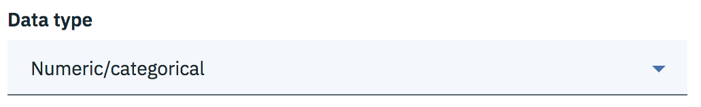  
Press **[Next]**  

Select "**Manually configure monitors**"  
  
Press **[Next]**  

Since this is a "*Risk"/"No-Risk*" type of binary model, select "**Binary classification**"  
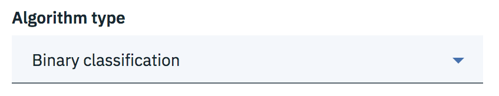  
Press **[Next]**  

On the "**Specify location of the training data**" page, the location of sample data should be pre-populated (from the model)  
  
Just press **[Next]**  

The **schema** and **table** info should also be pre-populated (from the model)  
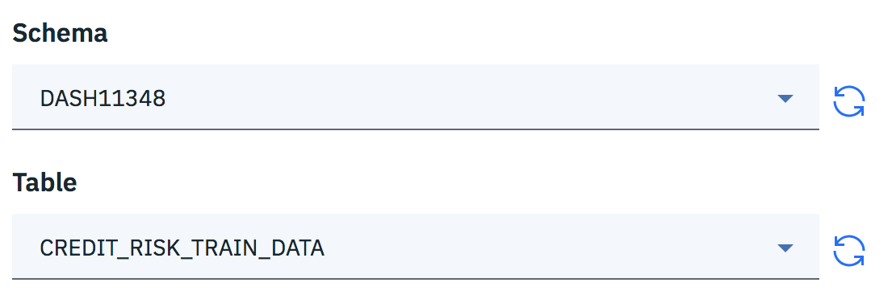  
Just press **[Next]**  

On the "**Select the label column from the training data**", select "**Risk**" as the pre-labeled column.  
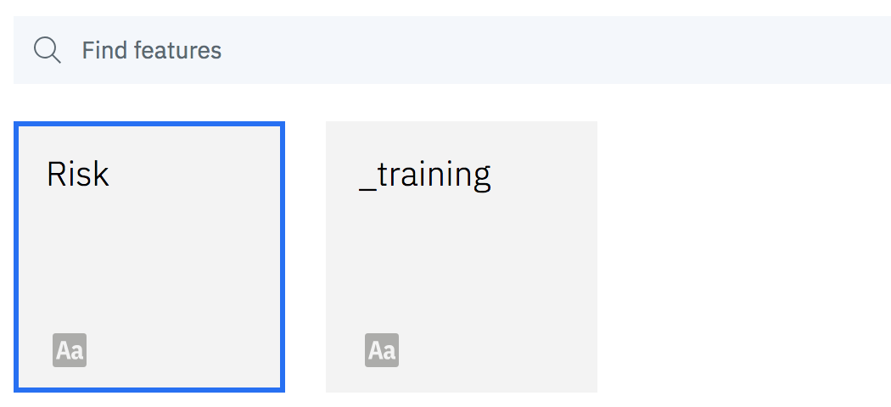  
Press **[Next]**  

On the "**Select the features used to train the AI deployment**", select **All** but **NOT** the last one, "\_training".  
  
The right options should be selected already by default.  
Press **[Next]**  

On the "**Select the text and categorical features**", select **All**, but **NOT** these:  
"Age", "CurrentResidenceDuration", "Dependents", "ExistingCreditsCount", "InstallmentPercent", "LoanAmount", "LoanDuration".  
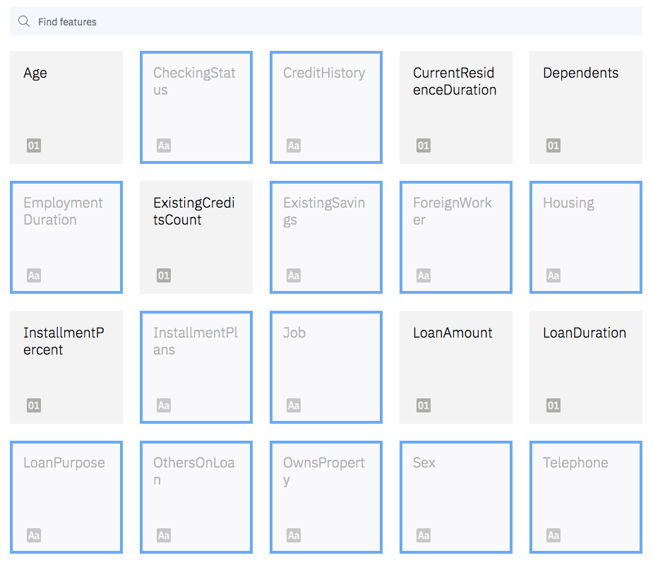  
The right options should be selected already by default.  
Press **[Next]**  

Review the monitoring summary.  
  
Press **[Save]** and then **[OK]**  

### <a name="step5.3">Step 5.3 - Configure fairness</a>

Press "**Fairness**"  
  
Press **[Next]**  

On the "**Select the features to monitor**", select "**Sex**" and "**Age**"  
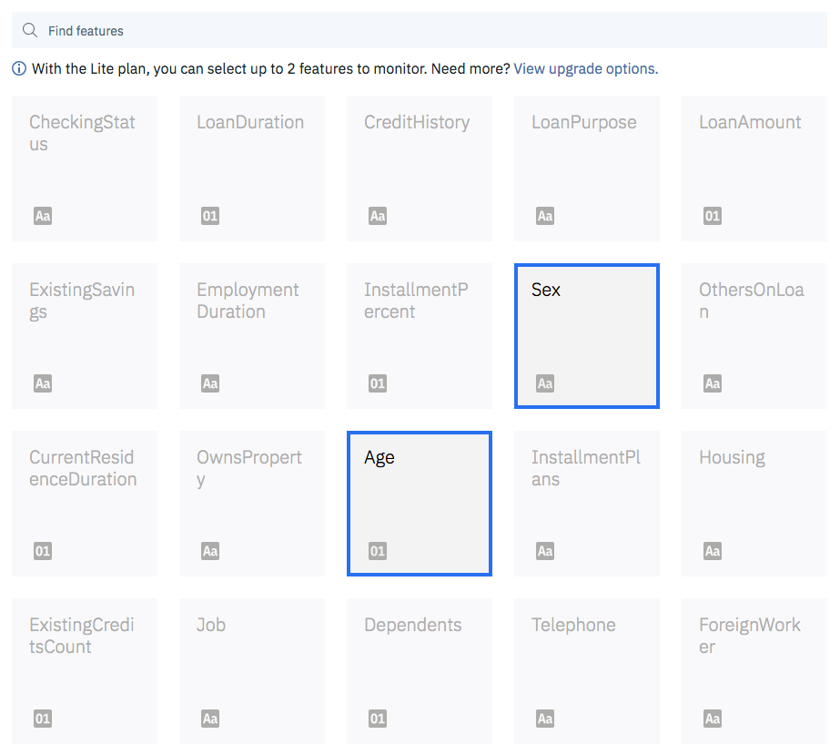  
Press **[Next]**  

On "**Specify reference and monitored groups [Sex]**", drag the values to following groups:  
  
Reference group: **male**  
Monitored group: **female**  
Press **[Next]**  

On "**Set fairness alert threshold [Sex]**", drag the slider to **90% fair**  
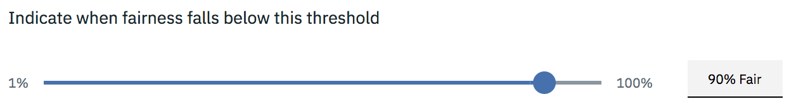  
Press **[Next]**  

On "**Specify reference and monitored groups [Age]**", set these age values for groups:  
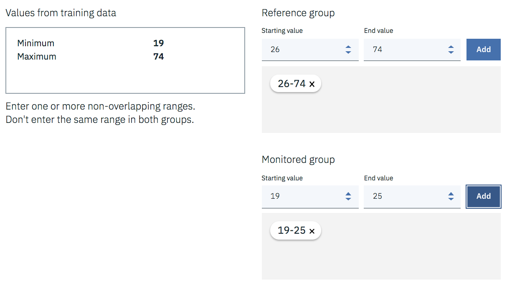  
Reference group:	**26-74**  
Monitored group:	**19-25**  
**Note**: Remember to press **[Add]** to apply values in the groups.  
Press **[Next]**  

On "**Set fairness alert threshold [Age]**", drag the slider to **90% fair**  
  
Press **[Next]**  

On "**Specify the favorable outcomes**", drag the values to following groups:  
  
Favorable values:	**No Risk**  
Unfavorable values:	**Risk**  
Press **[Next]**  

On "**Set minimum sample size**", drag the slider to value **100**  
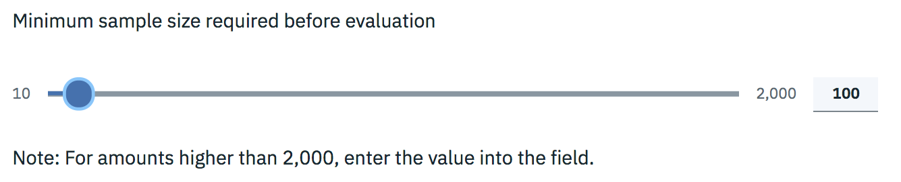  
Press **[Next]**  

Review fairness settings summary.  
  
Press **[Save]** and **[OK]**  

**NOTE**: Did you notice the implementation of a **debiased scoring endpoint**?  
  
When detected, OpenScale can mitigate bias by using various types of algorithms, depending on the type of bias.  
If you want to learn more about different ways (and algorithms) to detect and mitigate bias, take a look at the Open Source implementation of the "[AI Fairness 360 toolkit](https://aif360.mybluemix.net/)".  
Especially you should take a look at the [demo](https://aif360.mybluemix.net/data) to see how it works.  
There are also [links](https://aif360.mybluemix.net/resources) to reference papers, tutorials, guidance and more.  

### <a name="step5.4">Step 5.4 - Configure accuracy</a>

Press "**Accuracy**"  
  
Press **[Next]**  

On "**Set accuracy alert threshold**", drag the slider to **90% Good**  
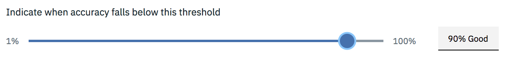  

On "**Set minimum and maximum sample size**", set sliders to following values:  
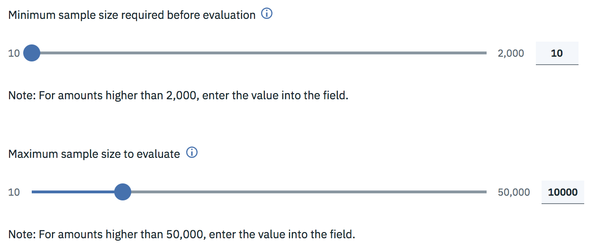  
Minimum sample size required before evaluation:	**10**  
Maximum sample size to evaluate: **10000**  
Press **[Next]**  

Review accuracy settings summary.  
  
Press **[Save]** and **[OK]**  

On the "**Implementation for feedback data**" page, notice the following:  
- **[Add Feedback Data]** button is provided to add feedback data right away  
- Sample **code snippets** are also provided to add feedback data programmatically  
  

Just for the demonstration, we'll be adding feedback data in the next step.  
Just press **[OK]** for now.  

You have now configured all monitors in OpenScale.  
On the "**Configure monitors**" page, press "**Go to Dashboard**" link.  
That will take you to the OpenScale dashboard page.  
  

## <a name="step6">Step 6 - Provide feedback data (pre-labeled data for monitoring accuracy)</a>

**Download** the following file, containing **pre-labeled feedback data**, somewhere on your computer:   
https://raw.githubusercontent.com/watson-developer-cloud/doc-tutorial-downloads/master/ai-openscale/credit_feedback_data.csv  

On the OpenScale **Insights dashboard**, select the "**credit-risk-deployment**" model  

**Note**: As you may have observed, in OpenScale we are soon switching to a new user interface.  
The next step depends on **which interface you are using, the new one (beta) or the old one (current)**.  
At the moment **you can switch between the old and new interface** in the **right uppper corner** of the Insights dashboard.  

If you are using the **new interface** (beta), then follow these steps:  
&nbsp;&nbsp;Under "**Quality**" category on left, select "**Accuracy**"  
&nbsp;&nbsp;On the "**Schedule**" widget on right, press "**Add feedback data**"  
&nbsp;&nbsp;  
&nbsp;&nbsp;You are now, again, on the "**Implementation for feedback data**" page, press **[Add Feedback Data]**  
&nbsp;&nbsp;Browse for **credit_feedback_data.csv** file on your computer and press **[Open]**  
&nbsp;&nbsp;On the "**Field delimiter**" dialog, select "**Comma (,)**" and press **[Select]**  
&nbsp;&nbsp;Once you see "**credit_feedback_data.csv uploaded succesfully**" message on page, press **[OK]** next to it  
&nbsp;&nbsp;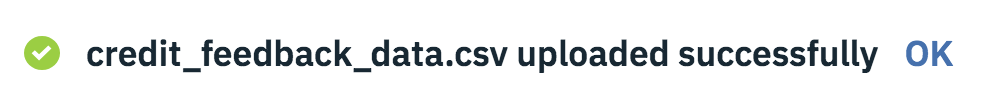  
&nbsp;&nbsp;Press **[OK]** on bottom of the page and you should be taken back to the "credit-risk-deployment" scenario  
&nbsp;&nbsp;Under "**Quality**" category on left, select "**Accuracy**" and press "**Check Quality Now**" on the right  

If you are using the **old interface** (current), then follow these steps:  
&nbsp;&nbsp;Press the **[Configuration]** button/icon on right  
&nbsp;&nbsp;  
&nbsp;&nbsp;Press **[Add Feedback Data]** button  
&nbsp;&nbsp;Browse for **credit_feedback_data.csv** file on your computer and press **[Open]**  
&nbsp;&nbsp;On the "**Field delimiter**" dialog, select "**Comma (,)**" and press **[Select]**  
&nbsp;&nbsp;Once you see "**credit_feedback_data.csv uploaded succesfully**" message in the widget, press **[OK]** next to it  
&nbsp;&nbsp;  
&nbsp;&nbsp;Click the **[Check Accuracy Now]** button  

## <a name="step7">Step 7 - Validate accuracy and fairness of the "Credit Risk" model in OpenScale</a>

**NOTE**: Since this is a new model with not much data yet, the graphs do not show much of the history.  
Over time, with more scoring events and more feedback data provided, the insights in OpenScale will improve.  

### <a name="step7.1">Step 7.1 - Quality of the model</a>

When exploring the Quality of the model and its training, the details in OpenScale and examination of Confusion Matrix displays will give insights that may suggest to either improve the model or train it with different data.  

On the insights for "credit-risk-deployment":  

Select **Quality** / **Accuracy**:  
  
- Based on the training data, the accuracy rating of the model shows **0.8**, which is ok but not too good  
Select **Quality** / **Area under ROC**:  
- Shows quality of **0.74** based on the feedback data, which is 0.16 below our threshold (0.9)  
- Zooming into events, it seems the model is **not very good at True positives** (TPR-rate 0.56, or 56,41%)  
    

Select **Quality** / **Recall**:  
-  Shows recall, which describes how many relevant items were selected, [True Positives / False Negatives], which is **0.56**  
Select **Quality** / **Precision**:  
- Shows precision, which describes how many selected items are relevant, [True Positives / (True Positives + False Positives)], which is **0.78**  

=> Quick conclusions:  
- Either wait for more scorings & provide more feedback data to see how it develops, or try retrain the model  

### <a name="step7.2">Step 7.2 - Fairness of the model</a>

When examining the Fairness of the model, we can see some insights whether we should be concerned about bias and, perhaps, consider re-model or re-train it differently:  

On the insights for "credit-risk-deployment":  

Select **Fairness** / **Sex**:  
  
- By "Sex", the "**Fairness Score**" **95%** is well above the threshold ([89% / 94%], which is 5% above threshold)  
- Click on the timeline to view details on the given time & events  
    
- With "**Payload + Perturbed**" the data is synthetized by switching Male <-> Female values to see how the model responses  
- With "**Payload**" only we see that there has been way less scoring transactions for females than for males  
- With "**Training**" only we see that also the training data had much less female data than male data  
- Also observe the "**Debiased**", which shows how OpenScale can mitigate bias  
    

=> Quick conclusions:  
- The model is not, at the moment, considered to be biased by feature "Sex"  
- However, to further improve it's fairness for feature "Sex", include more female samples in the training data  

Select **Fairness** / **Age**:  
  
- By "Age", the "**Fairness Score**" is **108%**, which is above 100% and indicates that our **monitored group is actually favored over the reference group**. This may suggest we should change our fairness monitors but we would first need more data before to decide.  
- Looking at the "**Training**" data in transactions view, we also see that **older people are getting more "Risk"** than younger people, which could indicate the same as above. But more data would be needed to confirm.  
    
- The same is is also evident when looking at scoring transactions ("**payload+perturbed**" and "**payload**"), where yonger people seem to have been favored over older people.  

To understand more closely, we may want to "**Explain**" some scoring transactions that have introduced bias.  
On the timeline for either age or sex fairness scores, **select a point in time that has some scoring request events**.  
**Click on the point in time** in chart to view details and then press **[View Transactions]**.  
  

By selecting "**Biased transactions**" you can then **Explain** both the *original* scoring transaction, and an *altered* transaction, which shows that **changing the monitored attribute in the original scoring would change the result of the scoring!**  
  

However, since there are not too much transactions to explain yet, let's create some in the next step, so that you may further explore the details.  

## <a name="step8">Step 8 - Make more scoring requests in WML to see how the monitored values change</a>

On the bottom right of a **fairness page**, press **[Make Scoring Request]** to see sample code snippets how you could make scoring requests.  
  

As discussed in [step 5](#step5), there are many ways to score requests with WML.  

Let's use a sample Python Notebook to make some 1000 random scoring requests.  
You can preview or download the sample notebook here:  
https://dataplatform.cloud.ibm.com/analytics/notebooks/v2/939cd559-c838-48a7-8f04-5414864cca97/view?access_token=2fb420637679cf3f7495c694c8467e2c609bf1cae10ce9de68bc1efb5851667b  
  

Go to your "AI model and validation" project in Watson Studio (or whatever the name of your project is).  
On the top actions, press **[+Add to project]**  
Select **Notebook**  
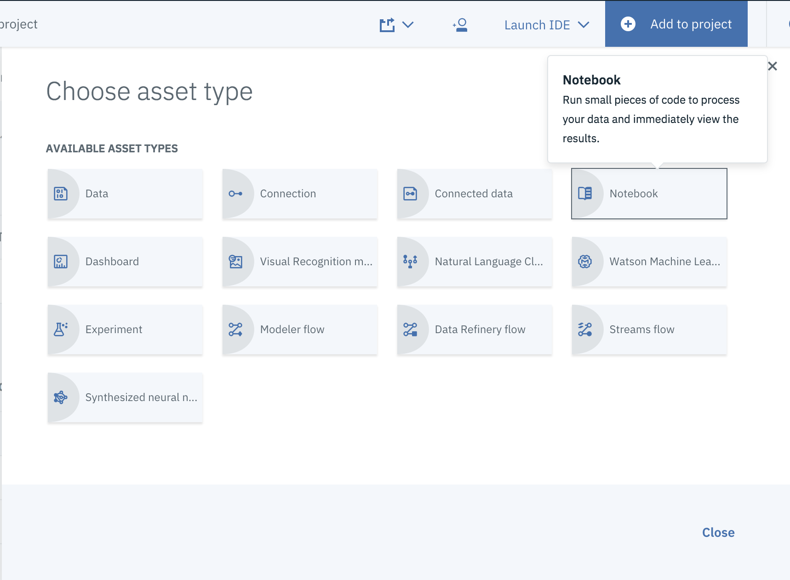  

Press "**From URL**" on the top and then set the Notebook values as:  
  
**Name**: Score Credit Risk model  
**Description**: Score Credit Risk model with 1000 randomly selected requests from sample data  
**Notebook URL**: https://github.com/jruponen/AIOS-tutorial-credit-risk/raw/master/Score%20Credit%20Risk%20model.ipynb  
**Select runtime**: Default Spark Python 3.5 XS (Driver with 1 vCPU and 4 GB RAM, 2 executors with  1 vCPU and 4 GB RAM each  

Press **[Create Notebook]**  

The Notebook opens in edit mode.  
  

**IMPORTANT**: Before you run it, follow the instructions on the Notebook to **fill in correct values in first two cells**!  

Watson Machine Learning service credentails (wml_credentials) are needed to do scoring requests.  
  

Scoring End-point URL (scoring_url) is the unique address of your deployed scoring endpoint for Credit Risk model.  
  

After you have corrected the values in the first two cells, **then you can run the Notebook**.  
Press **Run** button on the toolbar.  

You have now scored your model with 1000 randomly chosen records taken from sample data (containing approx 19000 records total).  

Go back to OpenScale insights for your "**credit-risk-deployment**" model.  
The **fairness** metrics are automatically checked hourly.  
To update them now to reflect new scorings, do the following:  

Select **Fairness** / **Sex**.  
On the right side **"Schedule"** widget, press **[Check Fairness Now]**.  

Once fairness checking is finished, take a look at the metrics now.  
What changes do you see and what observations can you make?

## <a name="step9">Step 9 - Provide additional feedback data to re-assess quality</a>

In order to re-assess quality, you'll first need to provide more feedback data.  

Download **additional feedback data** (pre-labeled data) from here:  
https://github.com/jruponen/AIOS-tutorial-credit-risk/raw/master/additional_feedback_data.csv  

Select **Quality** / **Accuracy** and on the "**Schedule**" widget on the right, press "**Add feedback data**"

On the "**Implementation for feedback data**" page, press **[Add Feedback Data]**

Browse for **additional_feedback_data.csv** file on your computer and press **[Open]**  

On the "**Field delimiter**" dialog, select "**Comma (,)**" and press **[Select]**  

Once you see "**additional_feedback_data.csv uploaded succesfully**" message on page, press **[OK]** next to it  

Press **[OK]** on bottom of the page and you should be taken back to the "credit-risk-deployment" scenario  

Select **Quality** / **Accuracy** and press "**Check Quality Now**" on the right  

On the right side **"Schedule"** widget, press **[Check quality now]**.  

Once quality checking is finished, take a look at the quality metrics now.  
What changes do you see (if any) and what observations can you make?  

**For more information, examine the rest of the OpenScale documentation**
https://cloud.ibm.com/docs/services/ai-openscale
